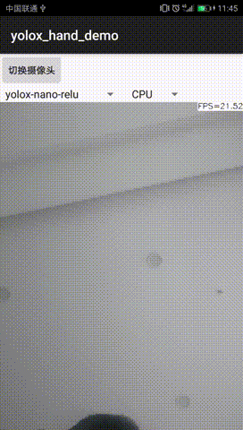
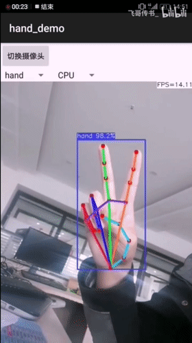

## ncnn_Android_hand  
a Android demo of hand detect and pose infer by ncnn  
A new mediapipe-hand demo in this place [new demo](https://github.com/FeiGeChuanShu/ncnn-Android-mediapipe_hand)  
### hand detect model    
1.nanodet  
2.yolox 
### hand pose model  
1.pfld  
2.mediapipe hand  

 
  
  
https://www.bilibili.com/video/BV1Uh411Q7Rq  
Reference：  
https://github.com/nihui/ncnn-android-nanodet  
https://github.com/Tencent/ncnn  
https://github.com/RangiLyu/nanodet  
https://github.com/Megvii-BaseDetection/YOLOX
